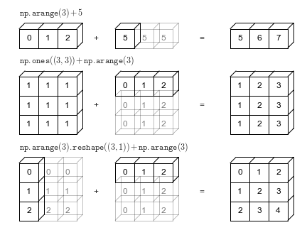

# Advanced Numpy

## Fancy Indexing
- Fancy indexing is a way to index numpy arrays using integer arrays or boolean arrays.
- It allows you to select multiple elements from an array at once, based on their indices or a condition.

## Boolean Indexing
- Boolean indexing is a powerful feature in Numpy that allows you to select elements from an array based on conditions.
- It involves creating a boolean array (an array of True/False values) that indicates whether each element in the original array meets a certain condition.
- You can then use this boolean array to index into the original array and extract the elements that satisfy the condition.

## Numpy array vs Python list
- Numpy arrays are more compact than Python lists.
- Numpy arrays provide better performance for numerical operations.
- Numpy arrays support vectorized operations, allowing for element-wise operations without explicit loops.
- Numpy arrays have a fixed size, while Python lists can dynamically resize.
- Numpy arrays support multi-dimensional data, while Python lists are typically one-dimensional.

## Broadcasting
- The term broadcasting describes how NumPy treats array with different shapes during arithmetic operations.
- The smaller array is "broadcast" across the larger array so that they have compatible shapes.

### Broadcasting Rules

#### 1. Make the two arrays have the same number of dimensions.

- If the numbers of dimensions of the two arrays are different, add new dimensions with size 1 to the head of the array with the smaller dimension.

#### 2. Make each dimension of the two arrays the same size.

- If the sizes of the each dimension of the two ararys do not match, dimensions with size 1 are stretched to the size of the other array.

- if there is a dimension whose size is not 1 in either of the two arrays, it cannot be broadcasted, and an error is raised

