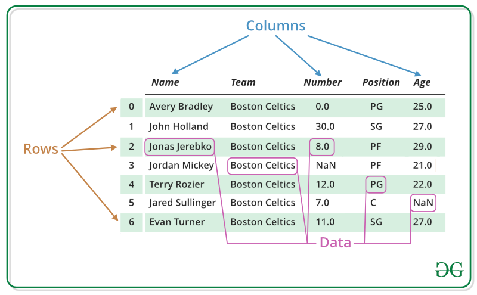

# Pandas DataFrame

- A DataFrame is a two-dimensional, tabular data structure in Pandas (Python library).

- Think of it like an Excel sheet or a SQL table:
    - Rows = records (index)
    - Columns = fields (labels)

