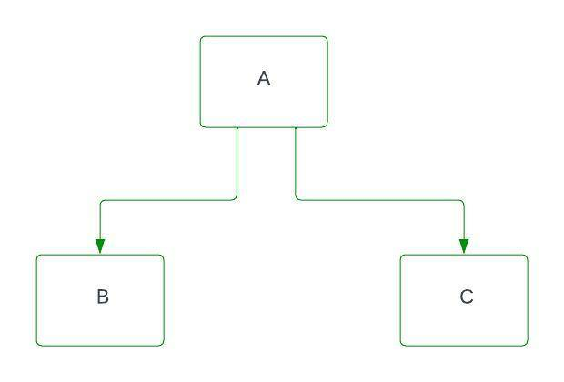
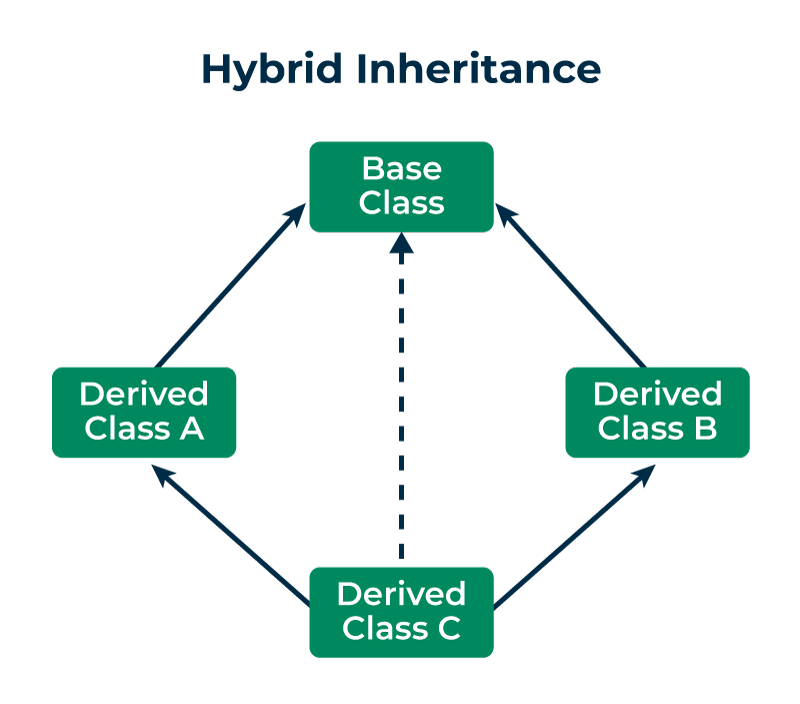

# OOP Part 3 | Inheritance & Polymorphism | Static

## Class Relationship

### 1. Aggregation
It means, when two classes have a (Has-A relationship).
In other words, you creates two classes and pass the 2nd class in 1st class as a reference object.

#### Aggregation class diagram

### 2. Inheritance
You can access your parent class properties.

#### Inheritance class diagram

#### What gets inherited?
1. Constructor
2. Non Private Attributes
3. Non Private Methods

### Inheritance in summary
1. A class can inherit from another class
2. Inheritance improves code reuse
3. Constructor, attributes, methods get inherited to the child class
4. The parent has no access to the child class
5. Private properties of parent are not accessible directly in child class
6. Child class can override the attributes or methods. This is called method overriding.
7. super() is an inbuilt function which is used to invoke the parent class methods and constructor

### Types of Inheritance
1. Single Inheritance

2. Multilevel Inheritance

3. Hierarchical Inheritance

4. Multiple Inheritance (Diamond Problem)

5. Hybrid Inheritance

# Polymorphism
Polymorphism enables a single action to be performed in different ways, depending on the object type or the context in which it's used. This means that a method, function, or operator with the same name can behave differently when applied to different objects or classes.

## Concepts

### 1. Method Overriding
Empowers a subclass (child class) to provide a specialized implementation for a method that is already defined in its superclass (parent class).

### 2. Method Overloading
An Object-Oriented Programming (OOP) feature that empowers a single class to possess multiple methods sharing the same name but distinct parameter lists.

In a single class, you have same name method twice but behaviour are different.

### 3. Operator Overloading
a powerful feature that allows programmers to redefine the behavior of existing operators like +, -, *, /, etc., when used with user-defined data types or objects.
