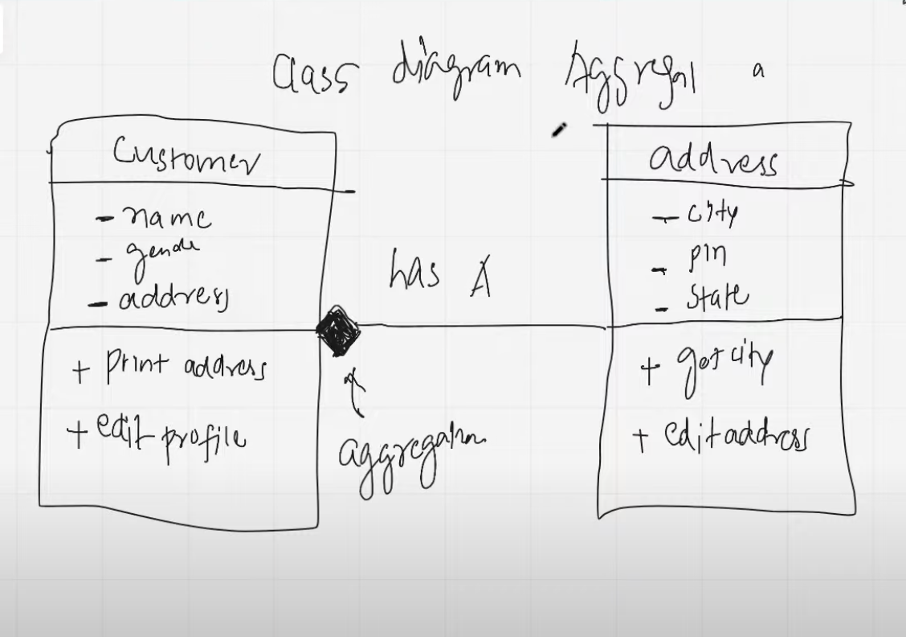
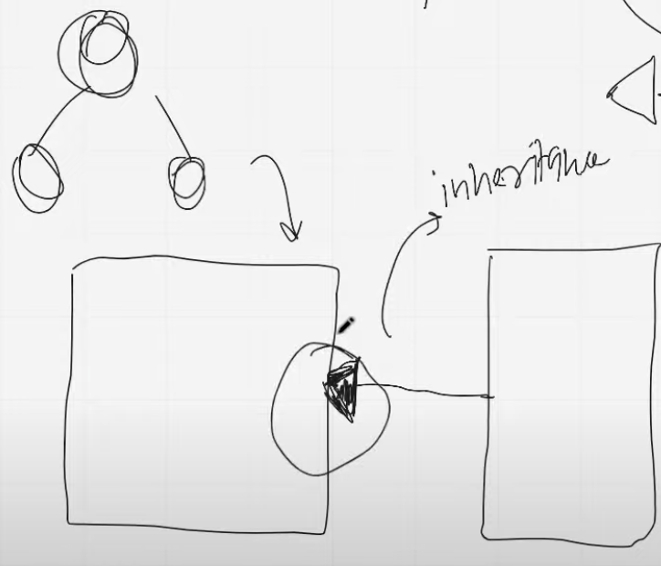

# OOP Part 3 | Inheritance & Polymorphism | Static

## Class Relationship

### 1. Aggregation
It means, when two classes have a (Has-A relationship).
In other words, you creates two classes and pass the 2nd class in 1st class as a reference object.

#### Aggregation class diagram

### 2. Inheritance
You can access your parent class properties.

#### Inheritance class diagram

#### What gets inherited?
1. Constructor
2. Non Private Attributes
3. Non Private Methods

