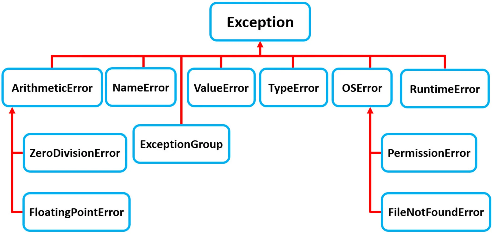

# Session 11 - Exception Handling & Modules and Packages

There are 2 stages where error may happen in a program

- During compilation (Syntax error)
- During execution (Exceptions)

## 1. Syntax Error

- Something in the program is not written according to the program grammar.
- Error is raised by the interpreter/compiler.
- You can solve it by rectifying the program.

### Example of Syntax Error

```
print 'hello world'
```

` IndexError`: The IndexError is thrown when trying to access an item at an invalid index.

`ModuleNotFoundError`: The ModuleNotFoundError is thrown when a module could not be found.

`KeyError`: The KeyError is thrown when a key is not found.

`TypeError`: The TypeError is thrown when an operation or function is applied to an object of an inappropriate type.

`ValueError`: The ValueError is thrown when a function's argument is of an inappropriate type.

`NameError`: The NameError is thrown when an object could not be found.

`AttributeError`: The AttributeError is thrown when you want to use string function on list.


## 2. Exceptions

If things go wrong during the execution of the program(runtime). It generally happens when something unforeseen has happened.

- Exceptions are raised by python runtime.
- You have to takle is on the fly.

### Examples
- Memory overflow
- Divide by 0 -> Logical error
- Database error


## Raise Exception
In Python programming, exceptions are raised when errors occur at runtime. We can also manually raise exceptions using the raise keyword.

```
raise NameError("Error")
```

## Exception hierarchy in python

