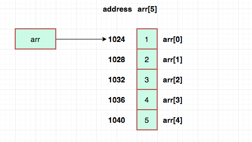

# List in Python

List is a data type where you can store multiple items under 1 name. More technivally, list act like dynamic arrays which means you can add more items on the fly.

```
list = [10, 23.5, "Abhishek", [2,6,10]]
```

## Array vs List
- Array
    - Array size is fixed
    - Arrays are homogeneous (You can store only one data types in case of c, c++)
    - Speed of execution is fast
    - It occupied less memory
    - It takes less time and space

- List
    - List is dynamic size
    - List is Hetrogeneous (You can store multiple data types like javascript)
    - Speed of execution is slow
    - It occupied more memory
    - It takes extra time and space

## Memory Allocation of List and Array

1. Array


2. List


## Characteristics of a list
1. `Ordered`: Elements have a defined order, and that order will not change.
2. `Mutable`: Elements can be changed, added, or removed.
3. `Hetrogeneous`: Elements can be of different data types.
4. `Allows duplicate values`: Lists can have multiple occurrences of the same value.
5. `Dynamic`: Lists can grow and shrink in size as elements are added or removed.
6. `Nested`: Lists can contain other lists as elements, allowing for complex data structures.
7. `Indexing and Slicing`: Elements can be accessed using their index, and slices of the list can be created.
8. `Supports various methods`: Lists come with built-in methods for manipulation, such as append(), remove(), pop(), sort(), reverse(), and more.
9. Add any kind of object in the list