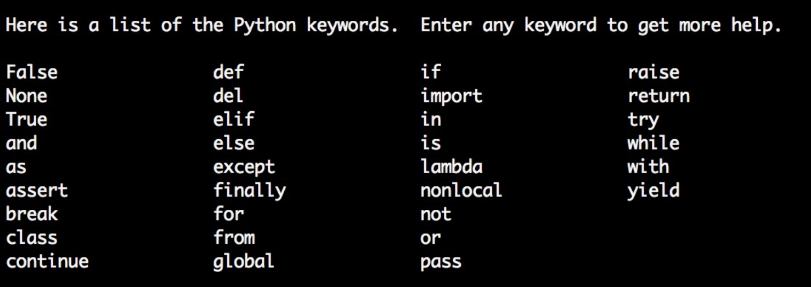

# Python Fundamental

## Today Topics

- About Topic
- Datatypes
- Variables, Keywords and Identifiers
- Python Input/Output
- If/Else Statement

## Why Python

1. `Design Philosophy`: Easy to learn and redable code to write code for many purpose.
2. `Batteries Included`: Already gives additional things like pre-defined funtions for programmers.
3. `General Purpose`: Means python supports a lot of programming paradiem. Ex: Backend server, Desktop application, ML and others
4. `Libraries/Community`: There are lot of python libraries and huge community.


## Why python for data science

1. `Easy to learn`: Even non-technical or mathematical person learn easily.
2. `Proximity with Maths`: There are lot of libraries for mathmetical domain. Ex: Numpy, Sumpy
3. `Community`: Huge Community


## Keywords & Identifiers in python

Keyword:


Identifiers: 

1. Whenever you create any variables or functions, you can't start with a digit

1name = "Abhishek" // Error

2. You can only use underscore (_) special character

first-name = "Nitin" # Error
first_name = "Nitin"

3. Identifiers can not be keywords

## User Input

```
fnum = input("Enter first number")
snum = input("Enter second number")

result = int(fnum) + int(snum)
print(result)
```


## Type Conversion

Implicit: Automatically converted by interpreture
Explicit: Programmer do type conversion

## Literals: 

Suppose you assign some value in a variable, that value is called literals

a = 0b1010 # Binary Literal
b = 100 # Decimal Literal
c = 0o310 # Octal Literal
d = 0x12c # Hexadecimal Literal

// Float Literal

float_1 = 10.5
float_2 = 1.5e2
float_3 = 1.5e-3

// Complex Literal
x = 3.14j

print(a,b,c,d)
print(float_1, float_2, float_3)
print(x, x.imag, x.real)
